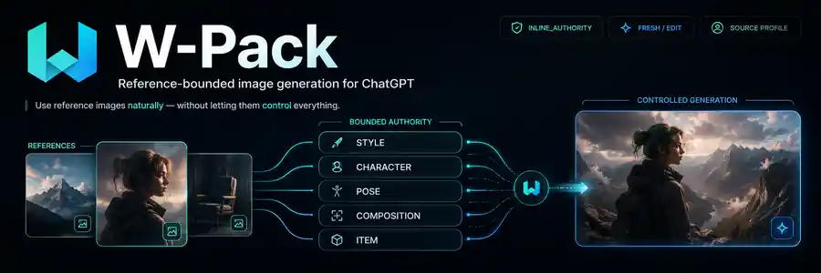
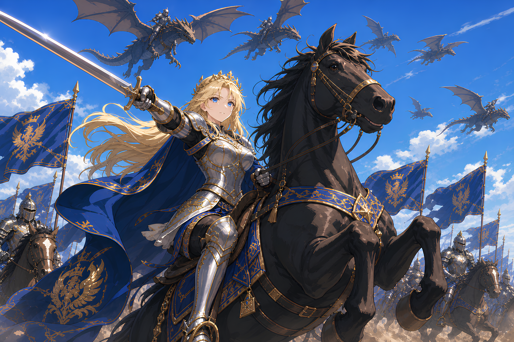

<p align="center">
  
</p>

<div align="center">

# W-Pack

### Reference-bounded image generation for ChatGPT

**Use reference images naturally without letting them silently control everything.**

[](#project-status)
[](#quick-start)
[](./skill)
[](#how-it-works)

**English** · [한국어](./README.ko.md) · [日本語](./README.ja.md) · [简体中文](./README.zh-CN.md) · [繁體中文](./README.zh-TW.md) · [Español](./README.es.md) · [Português (Brasil)](./README.pt-BR.md) · [Français](./README.fr.md) · [Deutsch](./README.de.md)

[Quick start](#quick-start) · [How it works](#how-it-works) · [Authority model](#authority-model) · [Project setup](#chatgpt-project-setup) · [Architecture](#architecture)

</div>

---

W-Pack is a chat-native control layer for image generation and editing inside **ChatGPT Web, ChatGPT Projects, and ChatGPT Skills**.

Instead of turning every reference image into an unrestricted visual prompt, W-Pack gives each reference a bounded authority: style, character, pose, composition, proportion, or item identity.

You can still speak naturally:

```text
Make it with the visual feel of the first image.
Keep the person from the second image unchanged.
Use the composition of the third image.
In this image, keep the face and composition but change only the outfit.
```

W-Pack resolves those instructions into explicit reference roles before ChatGPT generates the image.

> W-Pack does not replace ChatGPT image generation. It controls **how references are selected, scoped, preserved, and audited** before generation.

## Showcase

<p align="center">
  
  
  
</p>

<p align="center"><sub>Example outputs included for project presentation. Showcase images are not automatically used as authorities.</sub></p>

## Why W-Pack?

A normal multi-reference image request is ambiguous. If you attach three images, the model can unintentionally borrow the wrong person's face, the wrong framing, incidental objects, or unrelated styling.

W-Pack separates those concerns.

| Without W-Pack | With W-Pack |
| --- | --- |
| “Make it like this” can mean almost anything | Each reference gets a specific authority |
| A style reference may leak identity or composition | Style cannot silently control identity or layout |
| Previous outputs may become accidental references | Fresh generation is the default |
| Attached images need manual prompt bookkeeping | Current-chat images work as inline authorities |
| Complex reference prompts become JSON-like | Natural language stays natural |

## Highlights

- **Chat-native reference control** — use natural phrases such as “use this style,” “keep this person,” “use this pose,” or “use this composition.”
- **Inline references** — images attached in the current conversation do not need a manifest entry.
- **Six bounded authority roles** — `STYLE`, `CHARACTER`, `POSE`, `COMPOSITION`, `PROPORTION`, and `ITEM`.
- **Fresh vs edit semantics** — new generation and modification of an existing image are treated differently.
- **Project source profiles** — reusable reference sets can be activated with short requests.
- **Deterministic validation** — optional scripts catch authority conflicts and invalid requests before generation.

## Quick start

### 1. Install the Skill

Upload or install the contents of [`skill/`](./skill) as a ChatGPT Skill.

For a packaged Skill, use the validated `skill.zip` generated from this directory.

### 2. Use it directly in chat

Attach one or more reference images and say what each image should influence.

```text
@W-Pack

Use the first image for style only.
Keep the person from the second image unchanged.
Use the composition of the third image.

Background: sunset interior with soft natural light.
Aspect ratio: 4:5.
Generate a fresh image.
```

No JSON. No local CLI. No API key.

### 3. Or configure a reusable Project

For persistent references, copy [`project/PROJECT_INSTRUCTIONS.md`](./project/PROJECT_INSTRUCTIONS.md) into a ChatGPT Project and use [`project/AUTHORITY_MANIFEST.example.json`](./project/AUTHORITY_MANIFEST.example.json) as a starting point.

See [`QUICKSTART.md`](./QUICKSTART.md) for the compact setup path.

## Authority model

Every active generation reference receives one primary role.

| Role | Controls | Does not control by default |
| --- | --- | --- |
| `STYLE` | palette, texture, lighting language, rendering, graphic treatment | identity, pose, exact composition, item identity |
| `CHARACTER` | identity, face, hair, stable appearance | background, lighting, layout, unrelated items |
| `POSE` | body arrangement, gesture, stance, orientation | identity, wardrobe, environment, style |
| `COMPOSITION` | framing, crop, camera angle, placement, hierarchy, negative space | identity, wardrobe, item identity, global style |
| `PROPORTION` | body/object scale and relative dimensions | identity, detailed pose, style |
| `ITEM` | object identity, silhouette, key structure | character identity, environment, global style |

The core rule is simple:

> **Visible does not mean authorized.**

An incidental property in a reference image must not silently become part of the output.

Detailed semantics live in [`skill/references/authority-model.md`](./skill/references/authority-model.md).

## Natural-language resolution

W-Pack maps explicit chat intent to authority roles.

```text
“Use this visual feel”          -> STYLE
“Keep this person”              -> CHARACTER
“Use this pose”                 -> POSE
“Use this composition”          -> COMPOSITION
“Keep this product exactly”     -> ITEM
“Change only ... in this image” -> EDIT
“Generate a new image”          -> FRESH
```

W-Pack may infer a role from what the user **says**, but not merely from what happens to be visible inside an image.

See [`skill/references/chat-intent-resolution.md`](./skill/references/chat-intent-resolution.md).

## Fresh and edit modes

### `FRESH`

Use for a new image or a remake driven by approved references.

- Previous generated candidates are not silently reused.
- Only currently selected references may influence the run.
- This is the default when the user asks for a new image.

### `EDIT`

Use when the user explicitly wants to modify an existing image target.

Internally, edits may be classified as `MODIFY`, `RESTYLE`, or `RECOMPOSE`. Users do not need to name these subtypes.

## ChatGPT Project setup

Project mode is useful when the same references are reused across many generations.

```text
ChatGPT Project
├── Project instructions
├── reusable reference images
├── authority manifest
└── optional source profiles
```

A Project reference is never automatically active just because it exists in the Project. W-Pack selects only the references needed for the current request.

## How it works

```text
Natural chat request
  -> resolve FRESH vs EDIT
  -> resolve reference roles
  -> apply optional Project source profile
  -> validate scopes and conflicts
  -> compile scene / composition / lighting / text / preserve / avoid
  -> ChatGPT image generation
  -> silent output audit
```

W-Pack prefers the minimum reference set required for the request and allows at most five generation references.

## Architecture

```text
w-pack/
├── skill/                         # distributable ChatGPT Skill
│   ├── SKILL.md                   # control plane
│   ├── agents/openai.yaml         # Skill UI metadata
│   ├── scripts/
│   │   ├── validate_authorities.py
│   │   ├── compile_request.py
│   │   └── self_test.py
│   └── references/
│       ├── authority-model.md
│       ├── chat-intent-resolution.md
│       ├── generation-policy.md
│       ├── edit-policy.md
│       ├── source-profiles.md
│       ├── audit-policy.md
│       └── project-setup.md
│
├── project/                       # optional ChatGPT Project templates
│   ├── PROJECT_INSTRUCTIONS.md
│   ├── AUTHORITY_MANIFEST.example.json
│   └── GENERATION_REQUEST.example.json
│
├── PACK_SPEC.json                 # machine-readable harness contract
├── QUICKSTART.md
└── WPACK_DISTRIBUTION_BOUNDARY.json
```

The legacy `src/zpack`, `pack`, `private-assets`, and `output` paths are retained only for migration provenance and are not part of the ChatGPT Web execution path. See [`LEGACY.md`](./LEGACY.md).

## Validation

Run:

```bash
python3 skill/scripts/self_test.py
```

Expected result:

```text
W-Pack self-test: PASS
```

## Design principles

**Chat first.** Users should describe image work naturally instead of filling out schemas.

**Bound references, not creativity.** The scene can remain open-ended while reference influence stays explicit.

**Fresh by default.** Previous outputs never become hidden inputs to a new generation.

**Fail closed on real conflicts.** If two references claim incompatible control over the same property, W-Pack should surface the conflict instead of guessing.

**Audit quietly.** Successful generations should not be buried under verbose internal diagnostics.

## Project status

`WPACK_v0.3.0-chat-native` is the current ChatGPT Web milestone.

This release focuses on inline conversation references, natural-language authority resolution, composition authority, FRESH / EDIT semantics, optional Project source profiles, and deterministic request validation and compilation.

## Repository map

| Path | Purpose |
| --- | --- |
| [`skill/`](./skill) | installable Skill source |
| [`project/`](./project) | reusable ChatGPT Project configuration |
| [`QUICKSTART.md`](./QUICKSTART.md) | shortest setup path |
| [`PACK_SPEC.json`](./PACK_SPEC.json) | W-Pack machine-readable specification |
| [`LEGACY.md`](./LEGACY.md) | upstream migration boundary |

---

<div align="center">

**W-Pack** · Reference control for ChatGPT image generation

</div>
